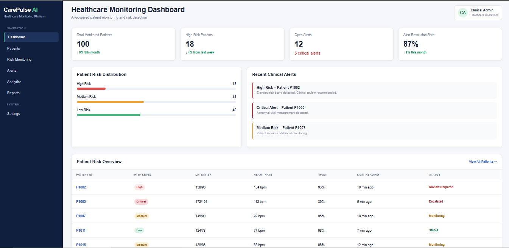

# CarePulse AI 🏥

### AI-Powered Healthcare Monitoring & Risk Detection Platform

CarePulse AI is a portfolio MVP for a healthcare monitoring platform designed to help clinical teams monitor patient vitals, identify elevated-risk patients, prioritize alerts, and support faster clinical review through AI-assisted insights.

> **Portfolio Project | Product Management + Business Analysis + Healthcare + Analytics + AI**

---

## 🚀 Live Dashboard

**[View the CarePulse AI Live Dashboard](https://ananyashahi-svg.github.io/ai-healthcare-monitoring-platform/)**

---

## 📌 Product Overview

Healthcare teams managing remote or continuously monitored patients can face large volumes of patient observations and clinical alerts.

CarePulse AI addresses this challenge by bringing together:

* Patient monitoring
* Vital-sign visualization
* Risk identification
* Clinical alert management
* Operational analytics
* AI-assisted patient insights
* Role-based access
* Auditability

The goal is to help clinical teams **identify important patient changes faster and prioritize their workload effectively**.

---

## 🎯 Problem Statement

Healthcare monitoring teams may need to review large amounts of patient data across multiple workflows.

This can create challenges such as:

* Difficulty identifying high-risk patients quickly
* High volumes of clinical alerts
* Manual review of patient trends
* Limited visibility into alert workload
* Delayed identification of important changes
* Difficulty measuring operational performance

### Product Opportunity

Build a centralized monitoring platform that transforms patient observations into actionable clinical workflow information while keeping clinicians responsible for final clinical decisions.

---

## 👥 Primary Users

### Clinicians

Need to quickly review patient vitals, risk levels, trends, and alerts.

### Care Managers

Need to monitor patient populations, assign alerts, manage workflows, and track unresolved cases.

### Healthcare Administrators

Need operational visibility into patient monitoring, alert volumes, response times, and resolution performance.

### System Administrators

Need secure role-based access and auditable user activity.

---

## 💡 Key Product Capabilities

### Patient Management

* Create patient profiles
* Search and view patients
* Track monitoring status
* Maintain patient information

### Patient Monitoring

* Blood pressure
* Heart rate
* SpO2
* Temperature
* Historical measurements
* Patient trend visualization

### Risk Detection

* Patient risk scoring
* Risk categorization
* High-risk patient identification
* Risk-contributing factors

### Clinical Alert Management

* Alert generation
* Alert prioritization
* Alert acknowledgement
* Alert assignment
* Alert escalation
* Alert resolution

### Analytics

* Monitored patient count
* High-risk patient count
* Open alerts
* Critical alerts
* Alert resolution rate
* Response time
* Escalation rate
* Alert trends

### AI-Assisted Insights

* Risk-factor explanations
* AI-generated patient summaries
* Identification of important trends
* Identification of missing data

> AI capabilities are designed as decision support and are not intended to provide autonomous diagnosis.

---

## 📊 MVP Dashboard

The live dashboard provides an operational view of the monitoring platform.
### 📸 Dashboard Preview



👉 **[View Live Dashboard](https://ananyashahi-svg.github.io/ai-healthcare-monitoring-platform/)**

### Example KPIs

| KPI                      | Example Value |
| ------------------------ | ------------: |
| Total Monitored Patients |           100 |
| High-Risk Patients       |            18 |
| Open Alerts              |            12 |
| Alert Resolution Rate    |           87% |

### Example Risk Distribution

| Risk Level | Patients |
| ---------- | -------: |
| High       |       18 |
| Medium     |       42 |
| Low        |       40 |

---

## 🧩 Product Workflow

```text
Patient Enrollment
        ↓
Vital Data Collection
        ↓
Data Validation
        ↓
Risk Assessment
        ↓
Alert Generation
        ↓
Alert Prioritization
        ↓
Clinical Review
        ↓
Acknowledgement / Escalation
        ↓
Resolution
        ↓
Operational Analytics
```

---

## 🤖 AI Product Approach

AI is positioned as an **assistive layer** rather than an autonomous clinical decision-maker.

### Example AI Use Cases

**Risk Explanation**

Explain the major factors contributing to an elevated risk score.

**Patient Summary**

Generate a concise summary of recent monitoring observations and alerts.

**Future Opportunities**

* Predictive risk forecasting
* Natural-language analytics
* Population-level risk analysis
* Automated workload insights

### Responsible AI Principles

* Human-in-the-loop clinical review
* Source-data traceability
* Clear AI-generated labeling
* No autonomous diagnosis
* Handling of incomplete data
* Monitoring for AI output quality

---

## 📈 Product Metrics

### Clinical / Patient Metrics

* High-risk patient identification rate
* Alert response time
* Alert escalation rate
* Alert resolution rate
* Patient monitoring adherence

### Operational Metrics

* Alerts per care manager
* Average alert resolution time
* Open alert backlog
* Critical alert response time
* Monitoring workload

### Product Metrics

* Daily active clinical users
* Patient profile views
* Alert acknowledgement rate
* Dashboard usage
* Feature adoption

---

## 🗂️ Product Documentation

| Document                                         | Description                                   |
| ------------------------------------------------ | --------------------------------------------- |
| [BRD](docs/BRD.md)                               | Business requirements and business objectives |
| [PRD](docs/PRD.md)                               | Product requirements and feature definition   |
| [Product Overview](docs/Product_Overview.md)     | Product vision, users and capabilities        |
| [User Journey](docs/User_Journey.md)             | End-to-end clinical workflow                  |
| [User Stories](docs/User_Stories.md)             | Agile user stories and acceptance criteria    |
| [MVP Prioritization](docs/MVP_Prioritization.md) | MVP feature prioritization                    |
| [Product Roadmap](docs/Product_Roadmap.md)       | Product development roadmap                   |

---

## 📊 Analytics & Data

The `analytics/` directory contains sample datasets and analytical work used for the portfolio MVP.

```text
analytics/
│
├── Analysis_Findings.md
├── KPI_Definitions.md
├── SQL_Queries.sql
├── alerts.csv
├── patient_vitals.csv
└── sample_patient_data.csv
```

The analysis covers:

* Patient monitoring data
* Vital-sign analysis
* Alert analysis
* KPI definitions
* SQL-based analysis
* Product insights

> Dataset values are synthetic and created for portfolio purposes.

---

## 🏗️ Repository Structure

```text
ai-healthcare-monitoring-platform/
│
├── index.html
│
├── analytics/
│   ├── Analysis_Findings.md
│   ├── KPI_Definitions.md
│   ├── SQL_Queries.sql
│   ├── alerts.csv
│   ├── patient_vitals.csv
│   └── sample_patient_data.csv
│
├── dashboard/
│   └── index.html
│
├── docs/
│   ├── BRD.md
│   ├── PRD.md
│   ├── Product_Overview.md
│   ├── MVP_Prioritization.md
│   ├── Product_Roadmap.md
│   ├── User_Journey.md
│   └── User_Stories.md
│
└── README.md
```

---

## 🔐 Security & Healthcare Considerations

A production implementation would require appropriate:

* Authentication
* Role-based access control
* Data encryption
* Audit logging
* Privacy controls
* Healthcare data protection
* Clinical validation
* Integration security
* Regulatory compliance

This portfolio project uses **synthetic patient data** and does not represent a production clinical system.

---

## 🧪 Edge Cases Considered

The product requirements consider scenarios including:

* Missing vital readings
* Invalid measurements
* Duplicate measurements
* Delayed device data
* Device disconnection
* Insufficient data for risk calculation
* Duplicate alerts
* Alerts for inactive patients
* Unavailable clinicians
* Alert escalation after resolution
* AI service unavailability
* AI output conflicting with source data

---

## 🛣️ Future Roadmap

### Phase 1 — MVP

* Patient management
* Vital monitoring
* Risk scoring
* Alert management
* Operational dashboard
* Role-based access

### Phase 2 — Intelligence

* AI risk explanations
* AI patient summaries
* Advanced trend analysis
* Improved operational analytics

### Phase 3 — Predictive & Population Health

* Predictive risk forecasting
* Natural-language analytics
* Population health dashboards
* Intelligent workload optimization

---

## 🎯 Product Management Approach

The product was designed using a structured Product Management / Business Analysis approach:

```text
Problem Definition
        ↓
User & Stakeholder Identification
        ↓
Product Discovery
        ↓
Business Requirements
        ↓
Product Requirements
        ↓
User Stories
        ↓
MVP Prioritization
        ↓
Analytics & KPIs
        ↓
Product Roadmap
        ↓
Prototype / Dashboard
        ↓
Validation & Iteration
```

Prioritization considered:

* Patient value
* Clinical workflow impact
* Business value
* Risk
* Engineering effort
* Data availability
* Security and compliance
* Scalability

---

## 👩‍💻 Skills Demonstrated

**Product Management**

* Product discovery
* Product strategy
* MVP definition
* Feature prioritization
* Roadmap planning
* Product metrics

**Business Analysis**

* Requirements gathering
* BRD / PRD
* User stories
* Acceptance criteria
* Process mapping
* Business rules
* Traceability
* UAT considerations

**Data & Analytics**

* SQL
* KPI definition
* Data analysis
* Healthcare analytics
* Operational insights

**Healthcare**

* Patient monitoring
* Clinical workflows
* Risk detection
* Alert management
* Remote monitoring concepts

**AI**

* AI-assisted decision support
* Risk-factor explanation
* Patient summarization
* Responsible AI considerations

---

## ⚠️ Disclaimer

CarePulse AI is a **portfolio MVP created using synthetic data and illustrative business rules**.

Clinical thresholds, risk models, workflows, integrations, and AI outputs would require validation by qualified clinical, security, compliance, and technical stakeholders before any production deployment.

---

## 📬 Project

**CarePulse AI — AI-Powered Healthcare Monitoring & Risk Detection Platform**

Built as a Product Management + Business Analysis portfolio project demonstrating end-to-end product thinking across healthcare, analytics, AI, requirements, and product delivery.
